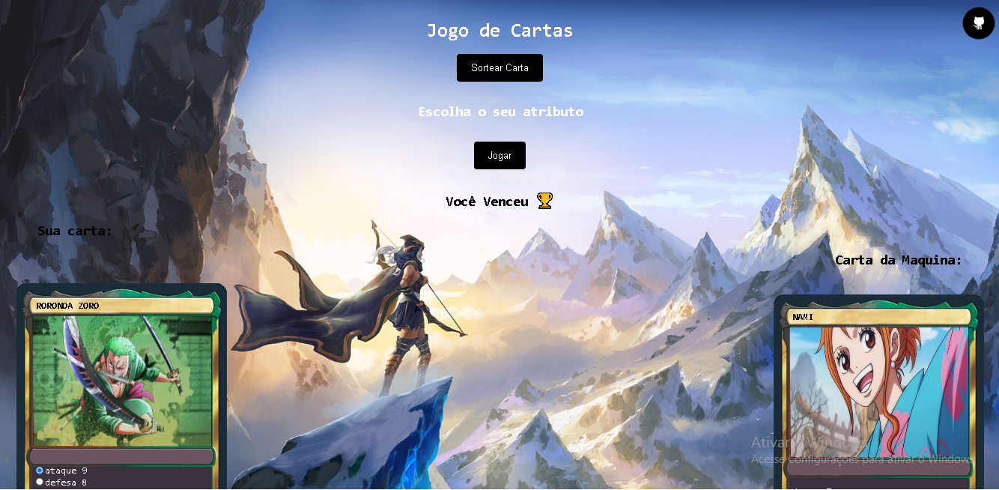

# Jogo de cartas
-Projeto desenvolvido na imersão alura. Jogo de cartas, sortear duas carta, uma do jogador outra da maquina, essas cartas possuem 3 atributos, ataque, defesa e magia, o jogador poderá escolher um desses atributos, que será comparado com o mesmo atributo da carta da máquina, o de maior valor vence.

